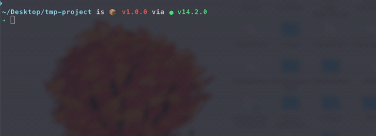

<h1 align="center">CSSPLIT</h1>
<h3 align="center">A CSS splitter that takes in your main.css file and splits into component specific css files</h3>

<div align="center" style="padding-top: 2em !important; padding-bottom: 2em; !important">
    
</div>

<div align="center">
<br/>

<a href="#usage">Usage</a>&nbsp;&nbsp;&nbsp;
<br/><br/>

[](https://golang.org)<br/><br/>
[](LICENSE) [](http://makeapullrequest.com)

</div>

# Usage

The script also allows following values from the commandline.

```console

usage: cssplit -dir -css -ext -exclude

arguments:

-dir  Project Directory
-css  Path to CSS file
-ext  File extensions to parse example=.html,.jsx"
-exclude  Files to exclude

```

example

```bash
cssplit -dir ~/project -css ~/project/main.css -ext ".html,.jsx" -exclude "utils,lib"

```

# Use It

**Want to use it ?**

Download the binary from the release page
[CSSplit](https://github.com/royalbhati/CSSplit/releases/tag/v1.0)

or clone the repo and compile it using

```console
  $ cd project
  $ go build
```
